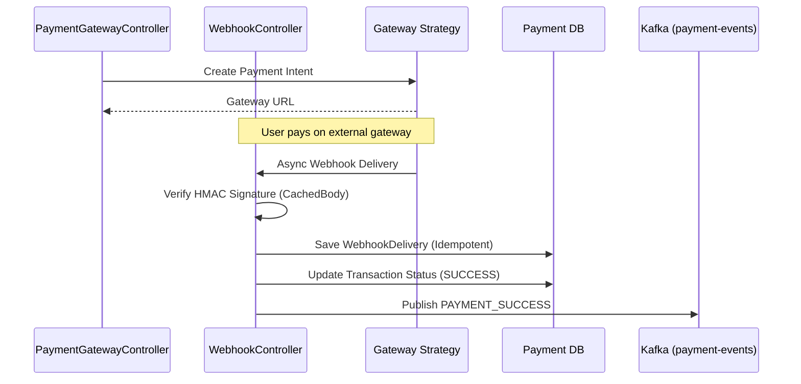

# Payment Gateway Integration Architecture

The Payment Service handles all interactions with external payment providers (e.g., Stripe, Razorpay, Vyapar). It provides a generic interface that abstracts away gateway-specific implementation details.

## Detailed Sequence Diagram

