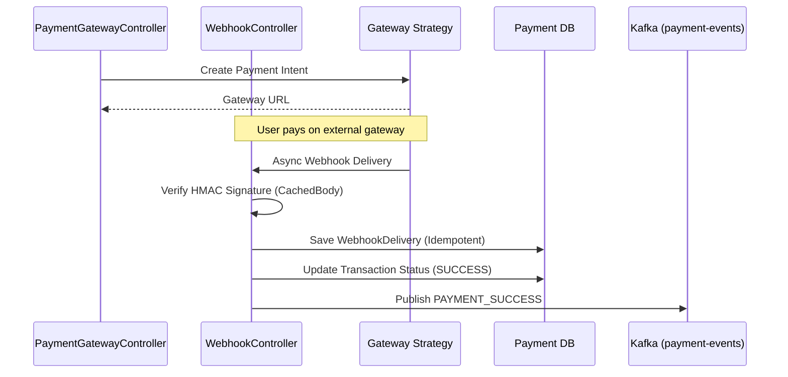

# Payment Gateway Integration

The Payment Service handles all interactions with external payment providers (e.g., Stripe, Razorpay, Vyapar). It provides a generic interface that abstracts away gateway-specific implementation details.

## Responsibilities

1. **Payment Intent Creation**: Generates payment URLs or client secrets for the frontend.
2. **Webhook Processing**: Securely receives async webhooks from external gateways when payments succeed, fail, or refund.
3. **Idempotency & Security**: Uses `IdempotencyFilter` to prevent double-charging and `RequestCachingFilter` (from CommonLibrary) to allow HMAC signature verification on incoming webhook payloads.

## System Flow & Webhooks

## Setup & Configuration

1. Connects to `payment_db`.
2. Requires `CommonLibrary` for the custom request wrapping filters and standard event serialization.
3. Start using `mvn spring-boot:run`. Flyway initializes the `payment_intents`, `transactions`, `refunds`, and `webhook_deliveries` tables.
